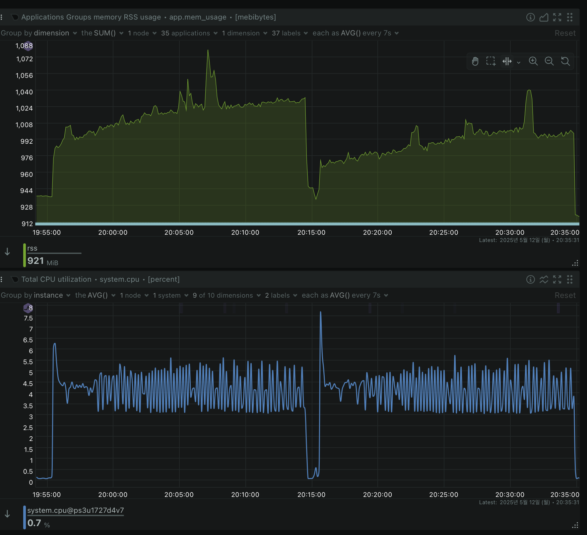
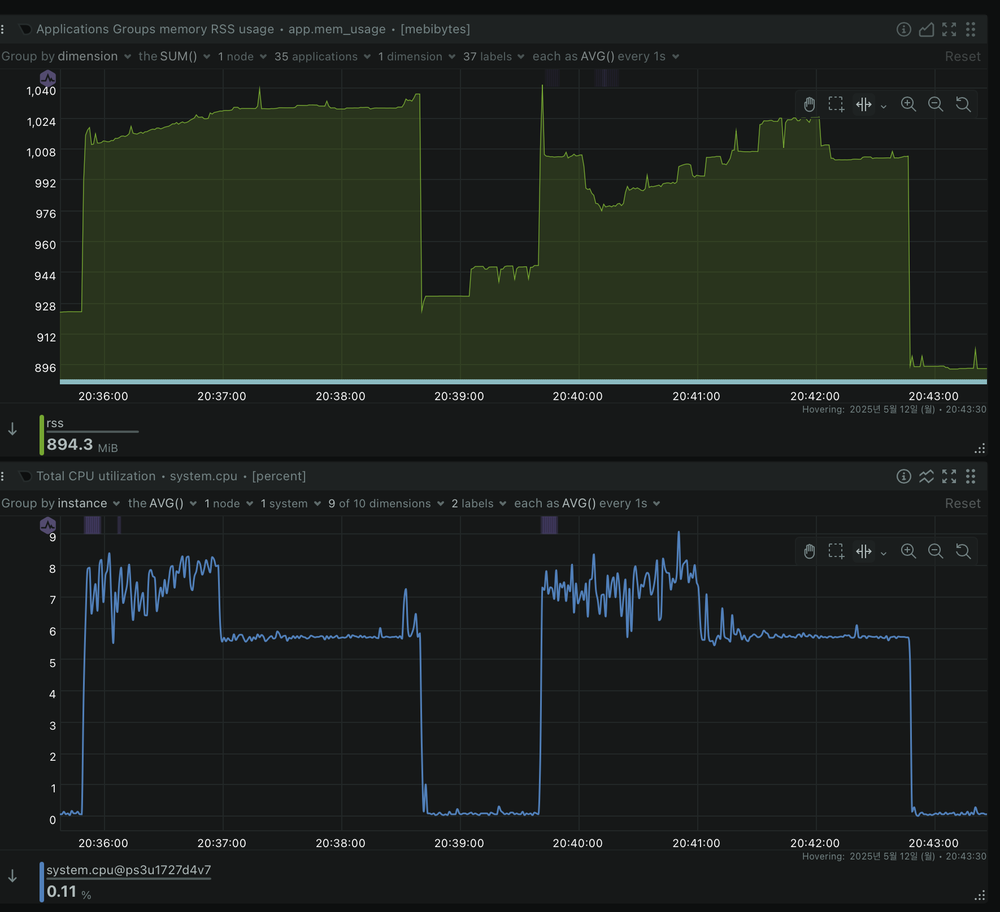
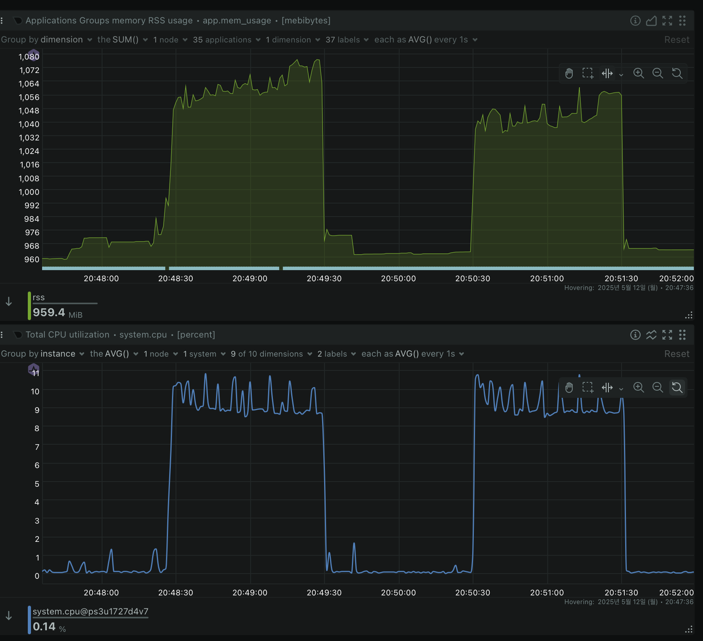

## 🔍 1. 실험 목적

> **"메모리를 아껴주는 Ribbon 필터는 실전에서도 Bloom을 대체할 수 있을까?"**


Ribbon 필터는 Bloom 필터보다 메모리 사용량을 최대 30% 줄일 수 있지만, 필터 생성 시 CPU 사용량이 더 높습니다. 

이 실험의 목적은 다음과 같습니다:
- **목적 1**: 동일한 false positive rate 설정에서 **Bloom vs Ribbon 필터의 성능(쓰기/읽기/공간 효율 등)**을 비교한다.
- **목적 2**: **Bits-Per-Key(bpk)** 값을 조절하며 성능이 어떻게 달라지는지 분석한다.
- **목적 3**: 워크로드 유형(읽기/쓰기 집중형)에 따라 어떤 필터가 유리한지 평가한다.
    

---

## 🧪 2. 실험 시나리오

### 🎯 실험 A. 기본 성능 비교: Bloom vs Ribbon (bpk=10)

- **가설**: 
    - 동일한 bits-per-key 조건에서 Ribbon은 메모리는 덜 쓰지만 쓰기 시 CPU 오버헤드가 발생할 것이다.
    - 읽기 쓰기 레이턴시는 비슷할 것이다.
    
- **설정**:
    - Filter: BuiltinBloom vs Ribbon
    - bits_per_key = 10
    - Workload: fillrandom, readrandom, readwhilewriting
    - Key-value: key=32B, value=1024B
    - 데이터 수: 5,000,000개 항목
    - write_buffer_size: 8MB
    - target_file_size_base: 8MB
    - 압축: 없음
    - 스레드: 2개
- **주요 확인 지표**:
    - `ops/sec` (특히 fillrandom, readrandom, readwhilewriting 각 단계별 처리량)
    - `latency (P50/P95)` (읽기/쓰기 지연 시간)
    - `memory usage` (필터 자체의 메모리 사용량 및 전체 DB 메모리 사용량)
    - `CPU 사용률` (특히 fillrandom 단계에서의 CPU 사용량)
    - `FPR`: False Positve Rate
    - 컴팩션 통계 및 빈도
    - DB 크기 비교
        

### 🎯 실험 B. Bits-Per-Key 다이얼 튜닝 실험

- **가설**: bits_per_key가 낮아지면 메모리 효율은 올라가지만 false positive 증가로 성능은 하락할 것이다.
    
- **설정**:
    - Filter: BuiltinBloom 또는 Ribbon
    - bits_per_key = 5, 7, 10, 12
    - Workload: readrandom
- **주요 확인 지표**:
    - `memory usage` (bpk 값에 따른 메모리 사용량 변화)
    - `ops/sec` (특히 readrandom에서의 처리량 변화, FP rate 증가로 인한 성능 하락 확인)
    - `latency (P50/P95)` (bpk 값에 따른 지연 시간 변화)
    - (실제 False Positive Rate의 변화 추이)
        

---

## 🖥️ 3. 실험 명령어

### 🔧 공통 설정

```bash
--num=5000000 \
--value_size=1024 \
--key_size=32 \
--threads=2 \
--block_size=4096 \
--write_buffer_size=8388608 \
--target_file_size_base=8388608 \
--compression_type=none \
--statistics \
--report_bg_io_stats=true
```

### ✅ 실험 A. Bloom vs Ribbon 기본 비교

```bash
# Bloom Filter
./db_bench --bloom_bits=10 --use_ribbon_filter=false --db=bloom_filter_db --benchmarks=fillrandom

# Ribbon Filter
./db_bench --bloom_bits=10 --use_ribbon_filter=true --db=ribbon_filter_db --benchmarks=fillrandom
```

각 필터 타입 별로 다음 벤치마크를 순차적으로 실행:
- fillrandom (데이터 삽입)
- readrandom (무작위 읽기)
- readwhilewriting (읽기 중 쓰기)

추가 모니터링:
- CPU, 메모리, 디스크 I/O 지속 모니터링
- 컴팩션 통계 수집
- 최종 DB 크기 비교


### ✅ 실험 B. bpk 다이얼 테스트

```bash
# Varying bits-per-key
for bpk in 5 7 10 12; do
  ./db_bench --bloom_bits=$bpk --use_ribbon_filter=false ...
done
```

---

## 🧠 결과 해석 프레임

- Ribbon의 **공간 절약 vs CPU 오버헤드**는 어떤 워크로드에서 더 타당한가?
- **읽기 중심** vs **쓰기 중심** 워크로드에서 어떤 필터가 적합한가?
- bits-per-key를 조절하면서 FPR이 실제 성능에 어떤 영향을 주는가?
    

---

## 📊 4. 실험 결과 요약

### 📈 실험 A 결과 요약


1. **성능 지표**:


2. **리소스 사용량**:

    #### 1. **fillrandom (랜덤 쓰기)**

    

    - **CPU 사용량:**
        
        - Bloom: **최소 3.08% ~ 최대 6.27%**
            
        - Ribbon: **최소 3.15% ~ 최대 7.71%**
            
        - → Ribbon이 최대 CPU 사용률이 **1.44%p 더 높음**, 이는 필터 생성 과정에서 **더 복잡한 연산**을 수행하기 때문으로 보임.
            
    - **메모리 사용량:**
        
        - Bloom: **986MB ~ 1079MB**
            
        - Ribbon: **965MB ~ 1040MB**
            
        - → Ribbon이 평균적으로 **약 30~40MB 적은 메모리**를 사용. 메모리 효율성이 뛰어남.
            


    #### 2. **readrandom (랜덤 읽기)**

    

    - **CPU 사용량:**
        
        - Bloom: **5.56% ~ 8.24%**
            
        - Ribbon: **5.57% ~ 8.34%**
            
        - → 거의 동일 (**0.1%p 차이**), 필터 조회 시 성능 차이는 **무시할 수준**.
            
    - **메모리 사용량:**
        
        - Bloom: **1011MB ~ 1037MB**
            
        - Ribbon: **980MB ~ 1025MB**
            
        - → Ribbon이 평균적으로 **약 20MB 더 적게 사용**, 읽기 성능은 유사하되 메모리 측면에서 이점 존재.
            


    #### 3. **readwhilewriting (쓰기 중 읽기)**

    

    - **CPU 사용량:**
        
        - Bloom: **8.71% ~ 10.86%**
            
        - Ribbon: **8.50% ~ 10.80%**
            
        - → 거의 동일 (**0.1%p 차이**), 필터 조회 시 성능 차이는 **무시할 수준**.
            
    - **메모리 사용량:**
        
        - Bloom: **1048MB ~ 1076MB**
            
        - Ribbon: **1035MB ~ 1067MB**
            
        - → Ribbon이 **10MB 정도 적게 메모리** 사용. 고부하 상황에서도 메모리 측면에서 유리.


